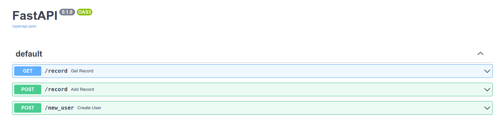
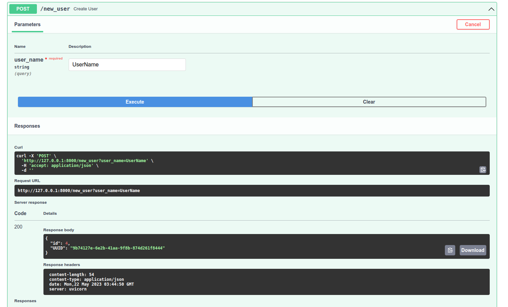
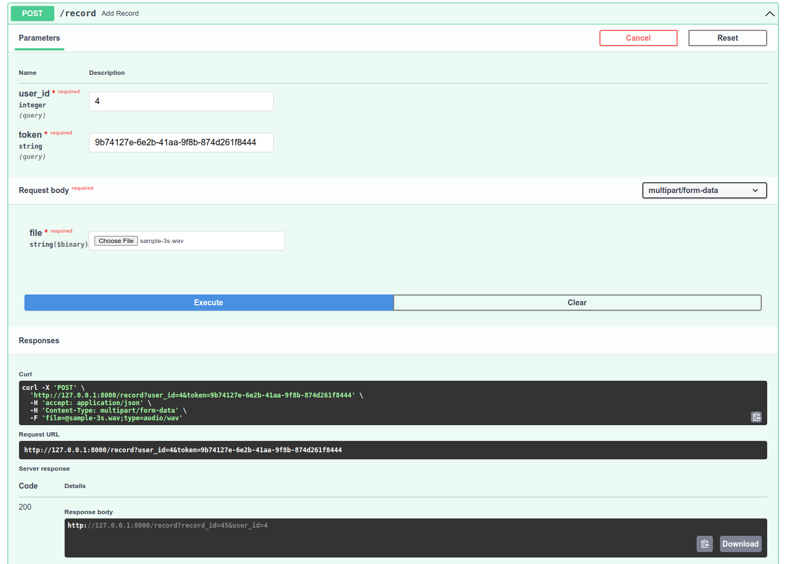
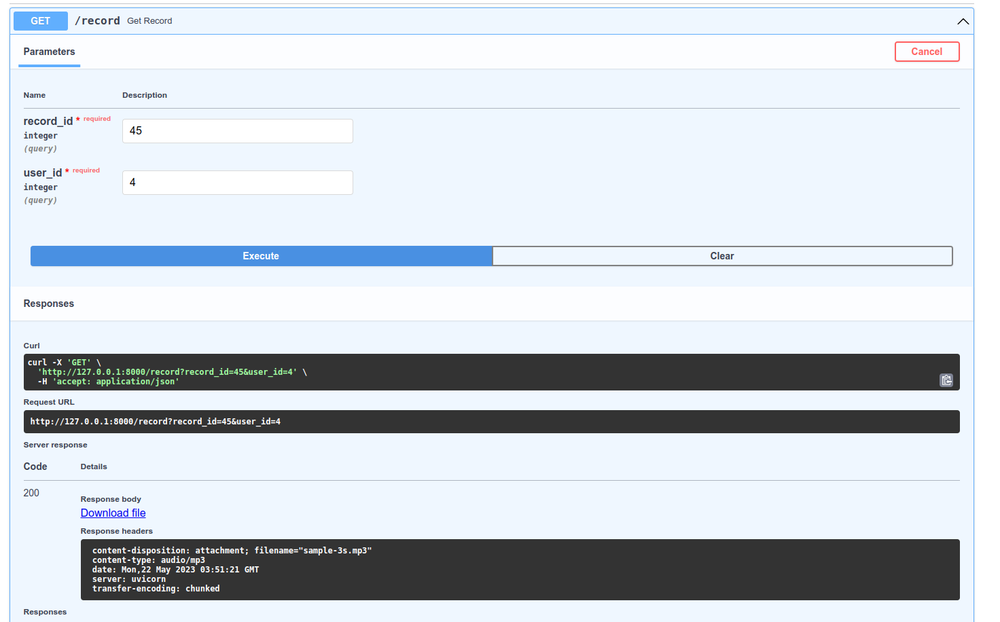
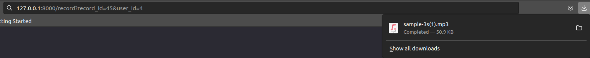

# Test Task 1
# To run app you could walk through next steps
# 1. Create new directory for project and change directory to project root folder: ~/.../<ProjectName>
    $ cd ~/.../<ProjectName>
# 2. Run command in terminal: 
    $ git clone https://github.com/leonidsliusar/BewiseAI_test_tasks.git
# 3. Create .env files for each app (task1, task2) with next environment variable:
    DB_USER=<set any username, for example postgres>
    DB_PASSWORD=<set any password>
    DB_HOST=<set localhost>
    DB_PORT=5430 | DB_PORT=5431  # for task1 | task2
    DB_NAME=<set any database name>
    
    # if ports 5430 and 5431 already in use you could change it to any free port in .env and in docker-compose.yml
    # but if you set the same port for both apps it wouldn't work properly
    services:
        postgres:
                ports:
                  - "{SET_PORT}:5432"
# 4. Create and run virtual environment (you could find full instruction in docs https://docs.python.org/3/library/venv.html):
    $ python -m venv <env name> | $ python3 -m venv <env name>
    $ source <env name>/bin/activate
    
    for deactivate 
    $ deactivate
# 5. Run command in terminal (be sure pip already install on your machine):
    $ pip install -r requirements.txt 

# 6. Change directory to desired task 1 or 2
    $ cd task1 | task2
# 7. Run command in terminal (be sure docker already installed on your machine):
    $ docker compose up -d
# 8. Run command in terminal:
    $ alembic upgrade head
# 9. Run command in terminal:
    $ uvicorn main:app | $ uvicorn main2:app

# To see how it works you could 
    The command 7. uvicorn main:app run the uvicorn local server.
    At the image below last string contains link, which you could open
    http://127.0.0.1:8000

    After you have opened link write in url address /docs#/
    For example:
    http://127.0.0.1:8000/docs#/
    This is an interactive API documentation provided by FastAPI 
    You can learn more about this https://fastapi.tiangolo.com/features/

    You could  interactively select API and use it by writting some request data and clicking Execute button

    
    The first request will send response with empty object

    
    Next request will send response with previous added question

    
    In second app is three API's

    At first you should create user
    API response to you with JSON with user id and UUID
    {
    "id": 4,
    "UUID": "9b74127e-6e2b-41aa-9f8b-874d261f8444"
    }

    The next API receives user id, user UUID and wav file
    And send link to download file in mp3
    The link redirect you to next API with record id and user id in endpoint query string

    
    The last API send file to you
    You could download it in FastAPI interactive API or just paste it in browser adress bar  

    Also you could check entries in database:
    Find the id and name of running container
    $ docker ps
    It shall be looks like:

    
    The next command provides you working with postgres inside container
    $ docker exec -it 11fbdbaf8830 psql -U <DB_USER>
    or by name of container
    $ docker exec -it postgres_server_test psql -U <DB_USER>

    Classic command for postgres:
    \l : show all data bases
    \c db_test_task : connect to desired db
    \dt : will show schema
    SELECT * FROM quiz_question; : get all entries in relation quiz_question
    \q : to quit from container

    You could see the volume of container which store data in localmachine
    That's why after restarted container the data keep save
    $ docker volume ls

    You could stop and start container again by docker command:
    $ docker ps : to show all running container
    $ docker compose stop : to stop container
    $ docker compose ps -a : to show all container
    $ docker compose start : to start container again

    You could run the app tests by
    $ pytest
